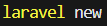
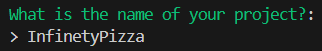
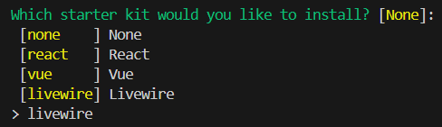
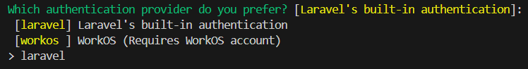
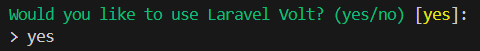
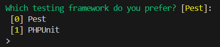
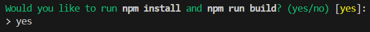

# Infinety Pizza

Prueba Técnica – Desarrollador/a Laravel + Livewire

## Introducción

Repositorio de Infinety Pizza, aplicación desarrollada como prueba técnica, cuyo objetivo es gestionar de forma sencilla la venta de pizzas.

## Instalación

### Comandos
Para la instalación del proyecto utilice "Laravel new"

Definí el nombre de la aplicación

Seleccione "Livewire" para el frontend

Elegí la autenticación integrada de Laravel

Habilite Laravel Volt que permite escribir componentes de Livewire en archivos únicos.

Seleccione "Pest" como framework de pruebas determinado.

Ejecute automáticamente los comandos de Node.js para instalar las dependencias del frontend

