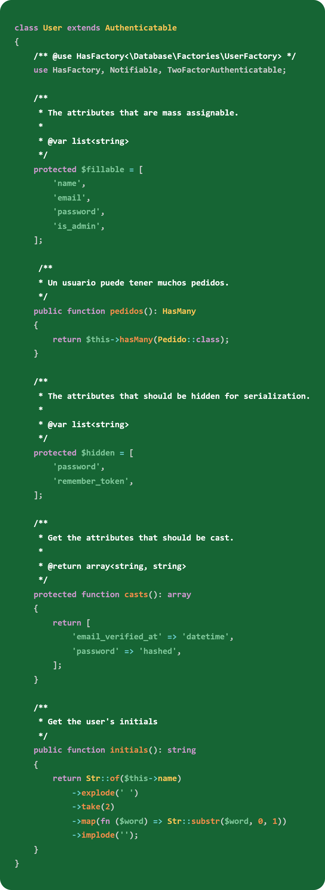
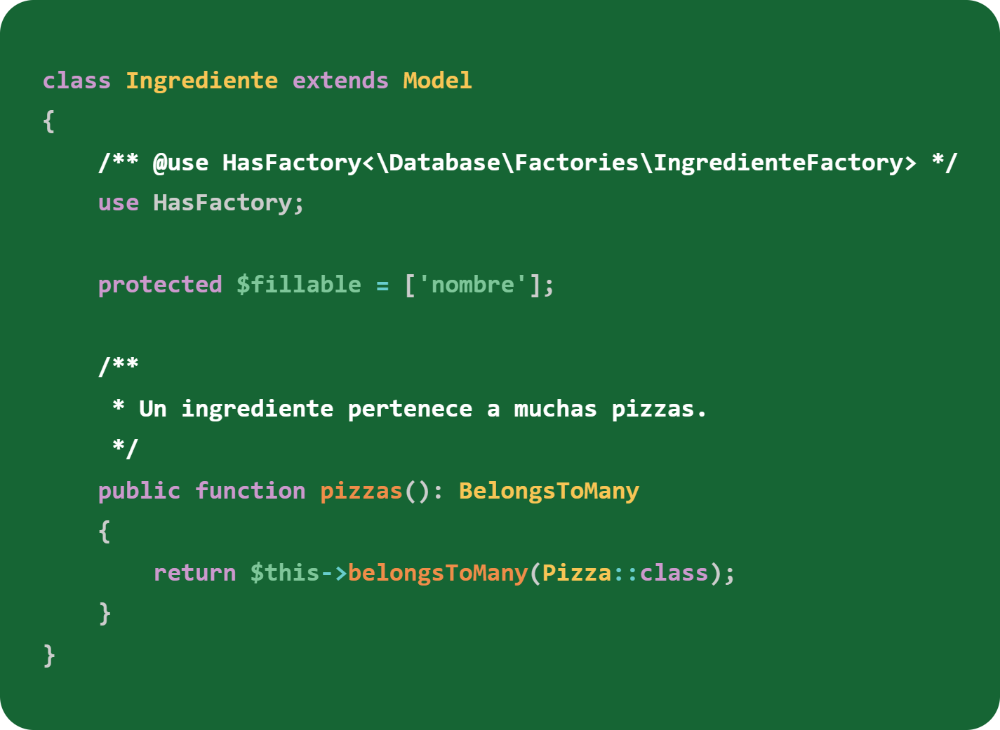
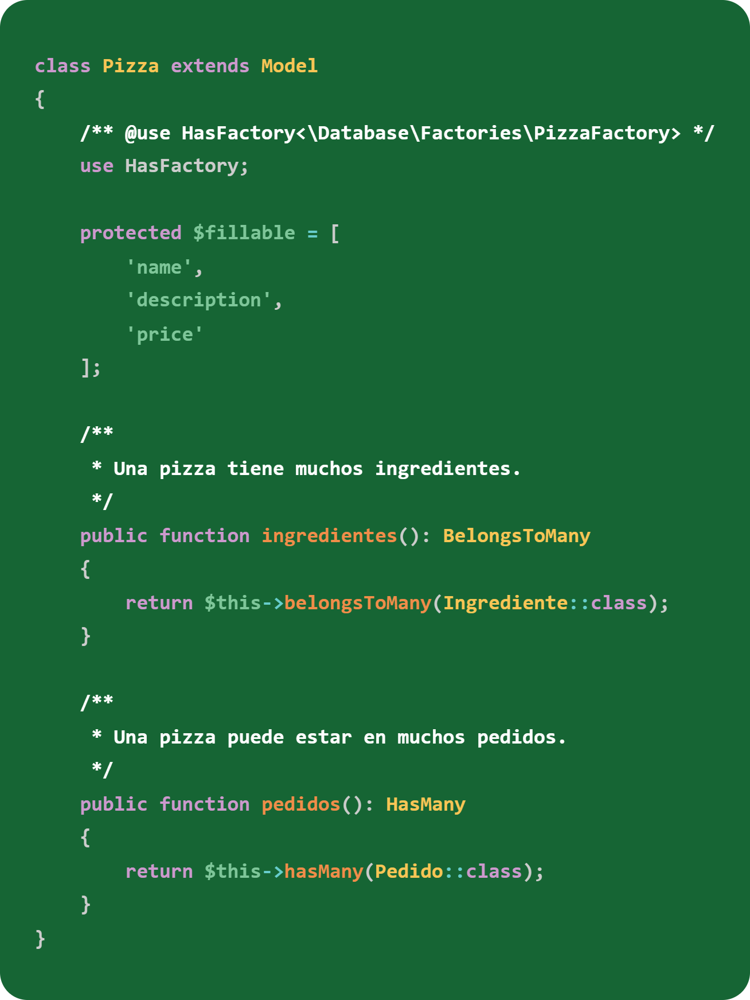
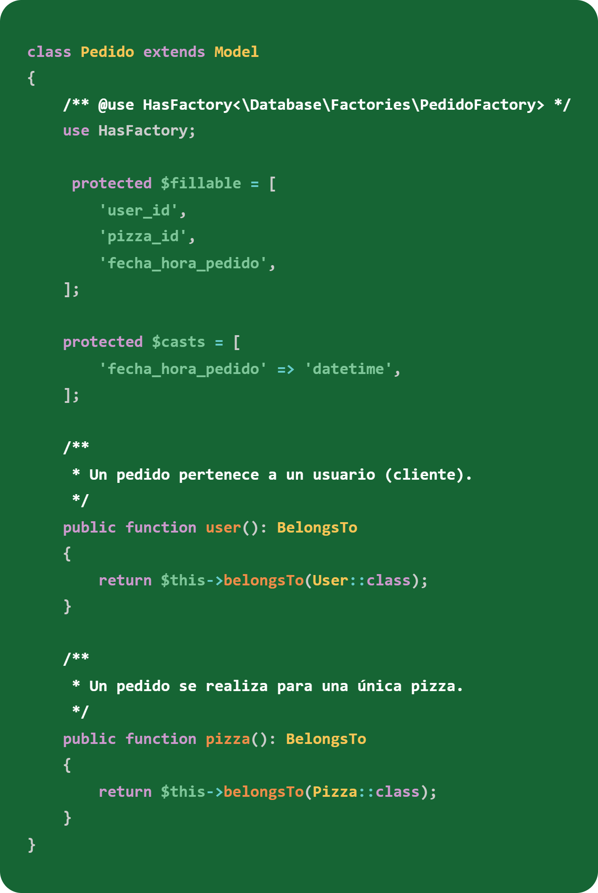

# Infinety Pizza

Prueba Técnica – Desarrollador/a Laravel + Livewire

## Introducción

Repositorio de Infinety Pizza, aplicación desarrollada como prueba técnica, cuyo objetivo es gestionar de forma sencilla la venta de pizzas.

## Instalación

### Comandos
Para la instalación del proyecto utilice "Laravel new"

Definí el nombre de la aplicación

Seleccione "Livewire" para el frontend

Elegí la autenticación integrada de Laravel (Breeze)

Habilite Laravel Volt que permite escribir componentes de Livewire en archivos únicos.

Seleccione "Pest" como framework de pruebas determinado.

Ejecute automáticamente los comandos de Node.js para instalar las dependencias del frontend

## Base de datos

El proyecto utilizara SQLite para la base de datos de desarrollo.

He optado por SQLite en lugar de MySQL para la configuración local por su simplicidad y portabilidad, ya que no requiere un servidor de base externo ni configuraciones complejas.

La base de datos se almacena en un solo archivo ***(database/database.sqlite)***

## Estructura de Datos

### Modelos

Para crear los modelos utilice el comando "***php artisan make:model ModeloNuevo -mf***". Este comando que permite generar rápidamente la clase del modelo, migración y factoría.

Estos son los modelos utilizados para estructurar y gestionar los datos.

    -User
    -Ingrediente
    -Pizza
    -Pedido

A continuación, se muestra un ejemplo de los modelos creados. 

#### Usuario

Los usuarios del sistema puede ser clientes o administradores. Siendo el rol quien determinará su acceso.

El modelo User extiende de la clase Authenticatable de Laravel, lo que le otorga todas las funcionalidades necesarias para la autenticación y seguridad.

El modelo User establece una relación uno a muchos con pedidos.

**pedidos() :** Un usuario puede realizar múltiples pedidos a lo largo del tiempo. 

#### Ingrediente

Entidad mas básica del sistema, almacena los componentes que se asignaran a las pizzas.

El modelo Ingrediente establece relación muchos a muchos con Pizza.

**pizzas() :** Un ingrediente puede ser utilizado para multiples tipos de pizza. Esta relación bidireccional se resuelve mediante la tabla pivot ***ingredient_pizza***

#### Pizza

Se almacenan los detalles de cada tipo de pizza disponible para la venta como nombre, descripción y precio.

El modelo Pizza establece una relación muchos a muchos con ingredientes y uno a muchos con pedidos.

**ingredientes() :** Define que ingredientes componen la pizza. La relación se gestionara mediante una tabla pivote ***ingredient_pizza*** permitiendo que una pizza tenga multiples ingredientes y que un ingrediente se use en multiples pizzas. 

**pedidos() :** Una pizza puede ser seleccionada por múltiples pedidos individuales.

#### Pedido

Registro de transacción del sistema, representa una unidad de una pizza ordenada por un cliente especifico.

El modelo Pedido establece relación muchos a uno con User y Pizza.

**user() :** Define que usuario pertenece el pedido. 

**pizza() :** Define cual pizza fue ordenada. 

### Migraciones 

### Seeders

### Configuración de Autenticación y Administrador  

## Extensiones utilizadas en VS Code

### Livewire Language Support 

### Laravel

Official Laravel VS Code Extension 

### Capture Code

