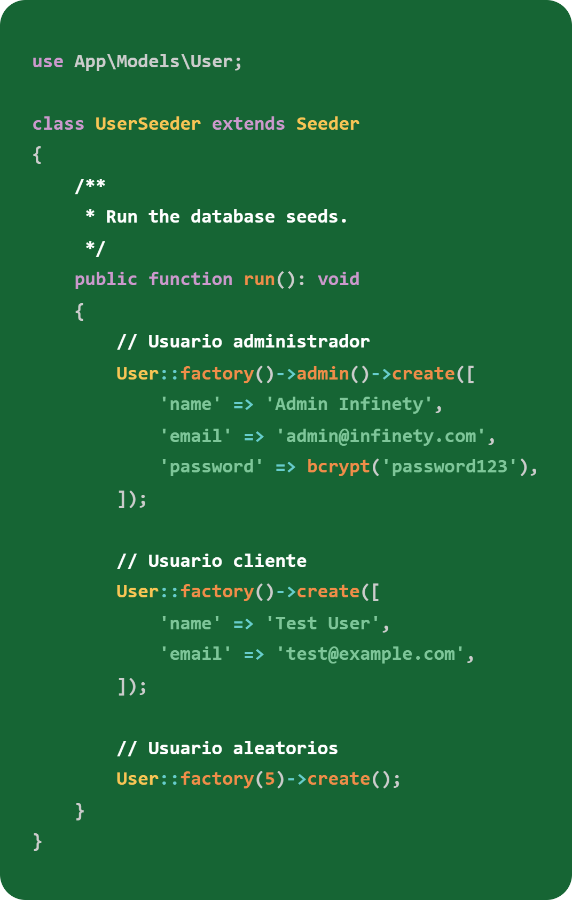

# Infinety Pizza

Prueba Técnica – Desarrollador/a Laravel + Livewire

## Índice

- [Introducción](#introducción)
- [Instalación](#instalación)
    - [Comandos](#comandos)
- [Base de datos](#base-de-datos)
- [Estructura de datos](#estructura-de-datos)
    - [Modelos](#modelos)
        - [Usuario](#modelo-usuario)
        - [Ingrediente](#modelo-ingrediente)
        - [Pizza](#modelo-pizza)
        - [Pedido](#modelo-pedido)
    - [Migraciones](#migraciones)
        - [Usuario](#migración-usuario)
        - [Ingrediente](#migración-ingrediente)
        - [Pizza](#migración-pizza)
        - [Pedido](#migración-pedidos)
        - [Ingrediente_Pizza](#migración-ingrediente_pizza)
    - [Seeders](#seeders)
        - [Comando de Ejecución](#comando-de-ejecución) 
        - [Usuario](#seeder-usuario)
            - [Factory](#userfactory)
            - [Seeder](#userseeder)
        - [Ingrediente](#seeder-ingredientes)
        - [Pizza](#seeder-pizza)
        - [Pedido](#seeder-pedido)
        - [Base de Datos Final](#base-de-datos-final)
- [Autenticación y Gestion de roles](#configuración-de-autenticación-y-administrador)
    - [Autenticación Breeze](#autenticación-breeze)
    - [Apariencia](#apariencia)
    - [Autorización](#autorización)
    - [Redirección Post-Login](#redirección-post-login)
- [Panel de Administrador](#panel-administrador)
   

## Introducción

Repositorio de Infinety Pizza, aplicación desarrollada como prueba técnica, cuyo objetivo es gestionar de forma sencilla la venta de pizzas.

## Instalación

### Comandos
Para la instalación del proyecto utilice "Laravel new"

Definí el nombre de la aplicación

Seleccione "Livewire" para el frontend

Elegí la autenticación integrada de Laravel (Breeze)

Habilite Laravel Volt que permite escribir componentes de Livewire en archivos únicos.

Seleccione "Pest" como framework de pruebas determinado.

Ejecute automáticamente los comandos de Node.js para instalar las dependencias del frontend

## Base de datos

El proyecto utilizara SQLite para la base de datos de desarrollo.

He optado por SQLite en lugar de MySQL para la configuración local por su simplicidad y portabilidad, ya que no requiere un servidor de base externo ni configuraciones complejas.

La base de datos se almacena en un solo archivo ***(database/database.sqlite)***

## Estructura de Datos

### Modelos

Para crear los modelos utilice el comando "***php artisan make:model ModeloNuevo -mf***". Este comando que permite generar rápidamente la clase del modelo, migración y factoría.

Estos son los modelos utilizados para estructurar y gestionar los datos.

    -User
    -Ingrediente
    -Pizza
    -Pedido

A continuación, se muestra un ejemplo de los modelos creados. 

#### Modelo Usuario

Los usuarios del sistema puede ser clientes o administradores. Siendo el rol quien determinará su acceso.

El modelo User extiende de la clase Authenticatable de Laravel, lo que le otorga todas las funcionalidades necesarias para la autenticación y seguridad.

El modelo User establece una relación uno a muchos con pedidos.

- **pedidos() :** Un usuario puede realizar múltiples pedidos a lo largo del tiempo. 

#### Modelo Ingrediente

Entidad mas básica del sistema, almacena los componentes que se asignaran a las pizzas.

El modelo Ingrediente establece relación muchos a muchos con Pizza.

- **pizzas() :** Un ingrediente puede ser utilizado para multiples tipos de pizza. Esta relación bidireccional se resuelve mediante la tabla pivot ***ingredient_pizza***

#### Modelo Pizza

Se almacenan los detalles de cada tipo de pizza disponible para la venta como nombre, descripción y precio.

El modelo Pizza establece una relación muchos a muchos con ingredientes y uno a muchos con pedidos.

- **ingredientes() :** Define que ingredientes componen la pizza. La relación se gestionara mediante una tabla pivote ***ingredient_pizza*** permitiendo que una pizza tenga multiples ingredientes y que un ingrediente se use en multiples pizzas. 

- **pedidos() :** Una pizza puede ser seleccionada por múltiples pedidos individuales.

#### Modelo Pedido

Registro de transacción del sistema, representa una unidad de una pizza ordenada por un cliente especifico.

El modelo Pedido establece relación muchos a uno con User y Pizza.

- **user() :** Define que usuario pertenece el pedido. 

- **pizza() :** Define cual pizza fue ordenada. 

### Migraciones

#### Migración Usuario

La migración Usuarios establecerá la autenticación de usuarios y la gestión de sesiones de la aplicación. Define tres tablas esenciales: **user, password_reset_tokens y sessions** 

- **id:** Clave primaria
- **name:** Nombre del Usuario.
- **email:** Dirección de correo del Usuario. Debe ser único.
- **email_verified_at:** Marca de tiempo que indica cuando se verifico el correo electrónico.
- **password:** Contraseña cifrada del usuario.
- **is_admin:** Campo booleano para determinar el rol, por defecto false (cliente), true para administradores.
- **remember_token:** Se utiliza para recordar al usuario después de cerrar el navegador.
- **created_at, updated_at:** Marca de tiempo que registra la creación y la ultima actualización del usuario.

#### Migración Pizza

La migración Pizza sera el catalogo de productos. 

- **id:** Clave primaria
- **name:** Nombre de la pizza, es unique para evitar duplicados.
- **description:** Descripción completa de la pizza.
- **price:** El precio de la pizza, es un decimal con 8 dígitos en total y dos decimales.
- **timestamps:** Registra la creación y ultima actualización del registro.

#### Migración Ingrediente

La migración Ingredientes serán los componentes individuales de las pizzas. 

- **id:** Clave primaria
- **name:** Nombre del ingrediente, es unique para evitar duplicados.
- **timestamps:** Registra la creación y ultima actualización del registro.

#### Migración Pedidos

La migración Pedido creara las transacciones de la aplicación depende de users y pizzas.

- **id:** Clave primaria
- **user_id:** Clave foránea al modelo User.
- **pizza_id:** Clave foránea al modelo Pizza.
- **fecha_hora_pedido:** Fecha y hora especifica de cuando se creo el pedido.
- **timestamps:** Registra la creación y ultima actualización del registro.

#### Migración Ingrediente_Pizza

Migración sin modelo creada para resolver la relación muchos a muchos entre las pizzas y los ingredientes.

- **ingrediente_id:** Referencia a la tabla ingredientes.
- **pizza_id:** Referencia a la tabla pizzas.

### Seeders

La aplicación utiliza Seeders para poblar la base de datos.

#### Comando de Ejecución

Para construir y poblar la base de datos de prueba, se utiliza el siguiente comando de Artisan:

**php artisan migrate:fresh --seed**

**migrate:fresh:** Borra todas las tablas existentes en la base de datos y ejecuta las migraciones desde cero.

**--seed:** Indica que, una vez que la estructura esté lista, debe ejecutar el DatabaseSeeder para iniciar la carga de todos los datos de prueba.

#### Seeder Usuario

Para poblar la tabla users con datos utilice una combinación de de UserFactory y UserSeeder para crear un par de usuarios de prueba. Un usuario Administrador y un Cliente asi como algunos clientes aleatorios con la contraseña "password" para todos los casos. 

##### UserFactory 

UserFactory define la estructura base para la crear instancias del modelo User. Ademas de métodos helpers para la diferenciación de usuarios.

- **definition() :** Aquí se definen los atributos por defecto para un nuevo usuario. Por default un usuario se crea como cliente, establecido en el campo **is_admin** en **false**. 
    - **'name' => fake()->name():** Genera un nombre aleatorio.
    - **'email' => fake()->unique()->safeEmail():** Se crea un email único y con formato valido. 
    - **'password' => static::$password ??= Hash::make('password'):** Genera un hash seguro de la contraseña.
    - **'remember_token' => Str::random(10):** Genera un token aleatorio.
    - **'two_factor_secret' => Str::random(10):** Clave secreta para la autenticación en dos factores (2FA).
    - **'two_factor_recovery_codes':** Código de respaldo para la 2FA.
    - **'two_factor_confirmed_at' => now():** Marca la fecha y la hora de la supuesta confirmación. 
    

- **admin() :** Esta función modifica el estado por defecto para crear un administrador cambiando el campo **is_admin** en **true**.

##### UserSeeder

El UserSeeder utiliza el UserFactory para crear 3 tipos de usuarios. (Usuario administrador, cliente y clientes aleatorios )

- **User::factory( )->admin( )->create([...]) :** Dentro de la función run() se hace uso del UserFactory y su estado admin() para sobrescribir el rol por defecto a administrador.
    - **Nombre:** Admin Infinety
    - **Correo:** admin@infinety.com
    - **Contraseña:** password123
- **User::factory( )->create([...]) :** Crea un usuario de prueba con su estado por defecto donde is_admin es false. 
    - **Nombre:** Test User
    - **Correo:** test@example.com
- **User::factory( 5 )->create( ) :** Crea usuarios aleatorios adicionales con nombres y correos electrónicos aleatorios, todos con el rol de cliente.

#### Seeder Ingredientes

Predefiní una lista de ingredientes básicos en un array llamado $ingredientes. 

Mediante un buble foreach itere el array $ingredientes usando el método **firstOrCreate( )**. Si el ingrediente ya existe en la base de datos, no hace nada. Si el ingrediente no existe, lo crea inmediatamente. De modo que nunca se duplicara.

#### Seeder Pizza

Cree las pizzas Margarita, Hawaiana y Pepperoni, añadiendo la relación muchos a muchos asociándolas a los ingredientes previamente creados.

- **$ingredientes = Ingrediente::all( )->keyBy('name'); :** Recupera todos los ingredientes, organizándolos en una colección. Reindexa la colección usando el nombre del ingrediente como clave.
    - **{"Mozzarella":{"id":1,"name":"Mozzarella"}, ...  }**

- **$getIngrediente = fn ($name) => $ingredientes->get($name)?->id; :** Se define a la variable $getIngrediente como una función que obtiene el ID de cualquier ingrediente usando el nombre. **?->id** garantiza que si un ingrediente no se encuentra, no cause un error.  

- **$margarita = Pizza::create([...]); :** Se inserta la pizza a la tabla asignando el nombre, descripción y precio base. El objeto $margarita ahora contiene la instancia del modelo con su ID.

- **$margarita->ingredientes()->attach([ $getIngrediente('Tomate'),]) :** Asociación muchos a muchos mediante la método **ingredientes( )** previamente creado en el modelo de Pizza y utiliza el método **attach( )** para añadir a la tabla pivote (**ingrediente_pizza**) pasándole el método **$getIngrediente( )** que devuelve el ID del ingrediente que se le pase por parámetro.

#### Seeder Pedido

Cree un pedido por pizza asignándolo al cliente de prueba con el fin de tener un listado de pedidos listo para el panel de administración.

- **$client = User::where('email', 'test@example.com')->first(); :** Se recupera la instancia del modelo cliente de prueba.

- **$pizzas = Pizza::all(); :** Carga todas las pizzas disponibles en la base de datos.

- **foreach ($pizzas as $pizza) { ... } :** Se itera sobre la colección de pizzas, creando un registro de Pedido con las claves del cliente y la pizza.

### Base de Datos Final

Después de ejecutar el comando **php artisan migrate:fresh --seed** la base de datos se creo correctamente y los seeders poblaron los datos de prueba. 
#### User

#### Ingredientes

#### Pizzas

#### Ingredientes_Pizzas

#### Pedidos

## Configuración de Autenticación y Gestion de Roles

### Autenticación Breeze

El sistema utiliza Laravel Breeze y la arquitectura Livewire/Blade para manejar la autenticación (Login, Registro, Recuperación de Contraseña y Verificación de Email). Breeze utiliza sesiones y cookies para mantener la identidad del usuario logueado.

### Apariencia

Se realizaron ajustes mínimos en las plantillas de para personalizar el aspecto visual:

- Logo/Favicon: Se reemplazaron los íconos predeterminado de Laravel por el logo de Infinety Pizza para mantener la identidad visual del proyecto.

### Autorización  

Se utiliza la configuración de Laravel a traves  de un middleware para asegurar que:

- Los administradores sean redirigidos al Panel de Administración (/admin/dashboard).
- Los cientes sean redirigidos a la pagina de inicio del cliente (/dashboard).

#### Rutas protegidas

Todas las rutas que formaran parte del panel de administración se agruparan y se les aplicaran el middleware AuthzMiddleware ('admin') junto con el middleware estándar de autenticación ('auth').

### Redirección Post-Login

La lógica de inicio de sesión se modificó para redirigir a los usuarios a un dashboard específico basado en su rol, en lugar de usar la ruta por defecto (/dashboard) para todos.

Se identificó el componente de Livewire/Volt que maneja el inicio de sesión (app/Livewire/auth/login.blade.php) y se modificó el método login()

## Panel Administrador

## Extensiones utilizadas en VS Code

### Livewire Language Support 

### Laravel

Official Laravel VS Code Extension 

### Capture Code
### SQLite Viewer
- [ ]

